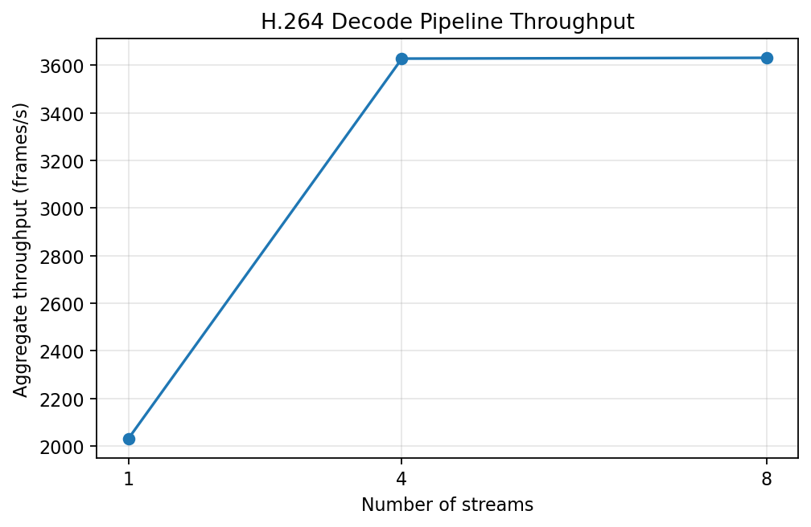

# H.264 decode pipeline profiling

Summary schema version: 1  
Generated by: `scripts/summarize_decode.py`  
Raw logs are the source of truth.

## Experiment purpose

NVIDIA Jetson AGX Thor에서 maximum-speed H.264 decode pipeline의 aggregate wall-clock throughput을 streams 수에 따라 characterization한다.

## Exact protocol

Power mode는 MAXN / ID 0, DVFS enabled, `jetson_clocks` 미사용 조건이다. streams={1,4,8}마다 3 runs를 수행했고, 모든 pipeline을 가능한 한 함께 PLAYING으로 전환한 시점부터 all-stream EOS까지 `time.perf_counter()`로 측정했다. 각 run은 stream당 9000 frames와 EOS를 검증했다.

## Pipeline

`filesrc -> qtdemux -> h264parse -> nvv4l2decoder -> fakesink` (`sync=false`). 이는 pure `nvv4l2decoder` execution time이 아니라 전체 decode pipeline의 maximum-speed wall-clock throughput이다.

## Input workload

H.264 High Profile, 1920x1080, 30 FPS, 300 s인 Warehouse_000의 `Camera_0000.mp4`를 사용했다. 동일한 Camera_0000 영상을 여러 independent pipelines에 replicate한 controlled workload이며, 서로 다른 4개/8개 camera video 실험이 아니다. 현재 Warehouse_000 local video set에서는 이 실험에 Camera_0000.mp4를 사용했다.

## Raw run results

| Streams | Run | Frames | Elapsed s | Aggregate fps | Per-stream fps |
|---:|---:|---:|---:|---:|---:|
| 1 | 1 | 9000 | 4.420267 | 2036.076 | 2036.076 |
| 1 | 2 | 9000 | 4.435953 | 2028.876 | 2028.876 |
| 1 | 3 | 9000 | 4.435856 | 2028.921 | 2028.921 |
| 4 | 1 | 36000 | 9.855444 | 3652.804 | 913.201 |
| 4 | 2 | 36000 | 9.993379 | 3602.385 | 900.596 |
| 4 | 3 | 36000 | 9.924486 | 3627.392 | 906.848 |
| 8 | 1 | 72000 | 19.839391 | 3629.144 | 453.643 |
| 8 | 2 | 72000 | 19.813367 | 3633.910 | 454.239 |
| 8 | 3 | 72000 | 19.837468 | 3629.496 | 453.687 |

모든 9 runs에서 각 stream=9000 frames, expected total frames 및 각 stream EOS=yes가 검증되었다.

## Mean/std/CV summary

| Streams | Runs | Mean elapsed s | Mean aggregate fps | Sample std fps | CV % | Mean per-stream fps | Scaling vs 1 |
|---:|---:|---:|---:|---:|---:|---:|---:|
| 1 | 3 | 4.430692 | 2031.291 | 4.144 | 0.204 | 2031.291 | 1.000x |
| 4 | 3 | 9.924436 | 3627.527 | 25.210 | 0.695 | 906.882 | 1.786x |
| 8 | 3 | 19.830075 | 3630.850 | 2.656 | 0.073 | 453.856 | 1.787x |

표준편차는 3개 run의 sample standard deviation (`statistics.stdev`, n-1), CV는 `sample std / mean × 100`이다.

## Scaling interpretation

1→4 streams에서 mean aggregate throughput이 증가한다. 4→8 streams에서는 aggregate throughput 증가가 거의 없는 plateau가 관찰된다. 이 결과만으로 `nvv4l2decoder` hardware 자체가 bottleneck이라고 단정할 수 없다.

## Limitations

이 controlled replicated-input 결과는 서로 다른 camera 입력의 동시 처리 결과가 아니다. file I/O, demux, parsing, memory subsystem, decoder resource sharing 중 어느 요소가 정확한 병목인지는 이 실험만으로 알 수 없다. 측정 범위에는 pipeline startup과 all-stream completion imbalance가 포함되며 pure NVDEC internal latency를 제공하지 않는다.
