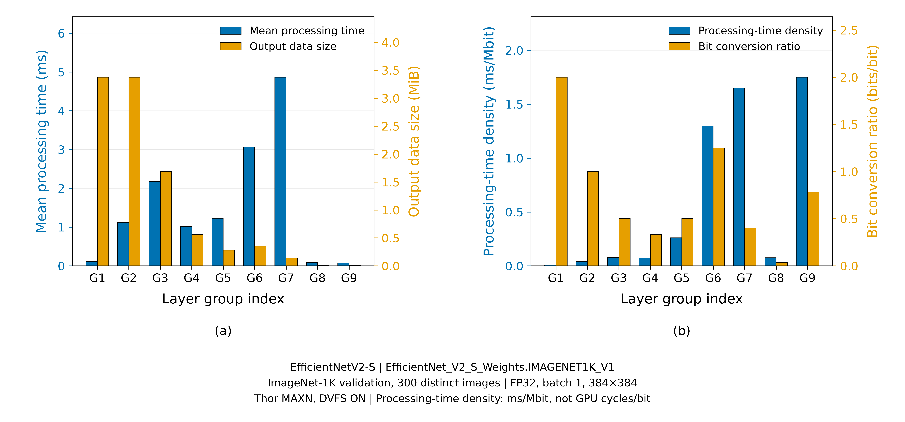

# EfficientNetV2-S pretrained ImageNet 그룹 특성 실측

**Thor 단독 GPU 처리시간이며 네트워크·서버·E2E 지연이 아니다.** 기존 dummy/random 결과를 보존하고 새 run으로 측정했다. Cutting-Edge Inference Fig. 1의 두 특성 패널에 대응하는 측정이며, 논문의 내부 경계 또는 전체 실험을 정확히 복제했다는 주장은 하지 않는다.

## 고정 조건

- EfficientNetV2-S
- EfficientNet_V2_S_Weights.IMAGENET1K_V1
- ImageNet-1K validation, 300 distinct images
- FP32, batch 1, 384×384
- Thor MAXN, DVFS ON
- Processing-time density: ms/Mbit, not GPU cycles/bit

`model.eval()` 및 `torch.inference_mode()`, seed 0, cuDNN benchmark=True. TF32는 matmul/cuDNN 플래그와 `TORCH_ALLOW_TF32_CUBLAS_OVERRIDE=0`, `NVIDIA_TF32_OVERRIDE=0`으로 비활성화했다. torch.compile/TensorRT 및 Edge 실행은 사용하지 않았다.

## 모델·이미지 출처

- 공식 checkpoint: `efficientnet_v2_s-dd5fe13b.pth` ([TorchVision 공식 URL](https://download.pytorch.org/models/efficientnet_v2_s-dd5fe13b.pth)). 캐시 부재로 이 파일만 다운로드했다. 파일 SHA-256: `dd5fe13b1d60ec15317ccc8ca158186e134d3366c3dde9cb9a4e301f2dc66c74`. TorchVision 파일명 hash prefix와 일치했다.
- canonical state_dict SHA-256: `dcac15dc687d43926f62a7942918dc73d11372abbb612352336b4d5840ca4710`. checkpoint를 weights_only=True로 읽은 state_dict, enum으로 생성한 모델, 측정 종료 모델이 모두 일치했다.
- Canonical v1은 모든 parameter와 buffer의 key를 사전순 정렬한다. 각 tensor마다 `[key, str(dtype), shape]`를 compact UTF-8 JSON으로 인코딩하고, uint64 little-endian header 길이 → header → uint64 little-endian payload 길이 → contiguous C-order little-endian CPU raw bytes를 SHA-256에 연결한다. 측정 스크립트의 `canonical_hash()`가 정확한 규격이다.
- ZIP: `/home/ainet/datasets/imagenet1k/imagenet-val.zip`, 6,669,976,535 bytes. 50,001 members = 50,000 JPEG + metadata JSON 1개. 중복 경로 없음, 1,000 class 디렉터리, 고유 validation basename 50,000개를 확인했다. 전체 추출은 하지 않았다.
- 전체 ZIP member 목록을 정렬하고 JPEG member만 필터링한 뒤 `random.Random(0).sample(images, 300)`으로 선택했다. sample ID는 선택 목록의 0-based 위치이며, round 0–4는 seed 1–5로 sample ID 순서를 각각 섞는다.
- 선택 목록 SHA-256: `f198e9fd3da063f0f4ae66dff1d6c76fdb66c7875abae88d462b37f96d338bc2` (`selected_imagenet_members.txt`, 마지막 newline 포함). 로컬 `selected_image_evidence.csv`에 각 JPEG와 전처리 FP32 tensor SHA-256도 기록했다.
- 300장 모두 ZIP CRC 검사·PIL 디코딩·RGB 변환·공식 `weights.transforms()`를 통과했다. 손상 이미지 0개, 제외·대체 0개. 오류 시 member와 traceback을 남기고 중단하며 자동 대체하지 않는다.
- 전처리는 enum이 제공하는 resize 384, center crop 384, bilinear, mean `[0.485,0.456,0.406]`, std `[0.229,0.224,0.225]`를 그대로 사용한다. 완전한 transform repr는 metadata에 있다.

### Git에 보존한 선택 메타데이터

- 선택 목록: [imagenet_profile/20260915T112015Z/selected_imagenet_members.txt](imagenet_profile/20260915T112015Z/selected_imagenet_members.txt)
- 이미지별 evidence: [imagenet_profile/20260915T112015Z/selected_image_evidence.csv](imagenet_profile/20260915T112015Z/selected_image_evidence.csv)
- 선택 목록 SHA-256: `f198e9fd3da063f0f4ae66dff1d6c76fdb66c7875abae88d462b37f96d338bc2`
- Evidence CSV SHA-256: `5706419efb22bd224d7c1b4bac5cceb22d479c3ec1336cc4e9cbb467301bf794`
- 선택 이미지 300개와 evidence 300행을 원본 순서·바이트 그대로 보존한다. 실제 이미지 데이터는 포함하지 않으며 서버의 재현성 검증을 위한 목록과 해시만 Git에 추가했다.

## 그룹 경계와 측정 방법

기존 공통 구현과 manifest는 수정하지 않았다. G1–G7=`features[0]`–`features[6]`, G8=`features[7] → avgpool → flatten(x,1)`, G9=`classifier`. 기존 manifest의 `weights:null`은 과거 검증 조건이며 이번 run의 weight는 위 metadata의 명시적 enum이다.

각 이미지에서 전처리 tensor → G1 → … → G9를 같은 pretrained model instance로 연속 실행한다. 각 그룹 입력은 직전 그룹의 실제 출력이며 독립적인 랜덤 activation은 없다. 입력 로딩·디코딩·전처리는 CPU에서 사전 준비하고, 각 이미지의 H2D와 synchronize를 첫 event 전에 완료한다.

각 그룹은 `start.record() → 해당 그룹만 실행 → end.record() → end.synchronize() → elapsed_time()`으로 측정한다. 그룹별 종료 synchronize를 유지하며 모든 CSV 기록은 9개 그룹 실행 후에 수행한다. 입력 준비·복사·host wait·파일 I/O는 event 구간 밖이다. eager kernel launch 사이 GPU idle gap은 device timeline에 포함될 수 있다.

전체 정확성 검증 후 선택 목록의 첫 100장으로 G1–G9 각각 warm-up 100회, 이후 5 rounds × 300 images = 그룹별 1,500개 표본이다. 300개의 고유 이미지에 대한 5회 반복이며 1,500개의 서로 다른 이미지라는 뜻은 아니다. warm-up 900행과 정식 측정 13,500행을 raw CSV에서 phase로 구분했다. 표본 제외·보간은 없다. std는 ddof=1, p95/p99는 linear quantile이다.

`input/output bytes = actual tensor.numel() × element_size()`이며 모든 이미지·실행에서 manifest shape와 대조했다. `MiB=bytes/2**20`, `sigma=output_bytes/input_bytes`, `processing-time density=mean_ms/(input_bytes*8/1e6)`이다. G9 출력은 4,000 bytes이지만 P9 local-only 업링크는 0 bytes다.

## 결과

단위: 처리시간 ms. 각 그룹 n=1,500. min/max/p99 및 전체 정밀도 값은 함께 커밋한 [group_summary.csv](imagenet_profile/20260915T112015Z/group_summary.csv)에 있다.

| Group | Mean | Median | p95 | Std | sigma (bits/bit) | Density (ms/Mbit) |
| --- | ---: | ---: | ---: | ---: | ---: | ---: |
| G1 | 0.113148 | 0.112288 | 0.121568 | 0.003289 | 2.000000 | 0.007993 |
| G2 | 1.122382 | 1.120800 | 1.133986 | 0.005474 | 1.000000 | 0.039644 |
| G3 | 2.178767 | 2.172208 | 2.211301 | 0.014228 | 0.500000 | 0.076957 |
| G4 | 1.013456 | 1.009248 | 1.038226 | 0.011056 | 0.333333 | 0.071593 |
| G5 | 1.228242 | 1.217328 | 1.287978 | 0.027155 | 0.500000 | 0.260298 |
| G6 | 3.065020 | 3.046880 | 3.119917 | 0.034258 | 1.250000 | 1.299125 |
| G7 | 4.863626 | 4.886544 | 4.915494 | 0.046958 | 0.400000 | 1.649179 |
| G8 | 0.089044 | 0.088064 | 0.097890 | 0.004230 | 0.034722 | 0.075483 |
| G9 | 0.071675 | 0.071168 | 0.076643 | 0.003117 | 0.781250 | 1.749877 |

| Group | Input shape | Output shape | Input bytes | Output bytes |
| --- | --- | --- | ---: | ---: |
| G1 | `[1, 3, 384, 384]` | `[1, 24, 192, 192]` | 1,769,472 | 3,538,944 |
| G2 | `[1, 24, 192, 192]` | `[1, 24, 192, 192]` | 3,538,944 | 3,538,944 |
| G3 | `[1, 24, 192, 192]` | `[1, 48, 96, 96]` | 3,538,944 | 1,769,472 |
| G4 | `[1, 48, 96, 96]` | `[1, 64, 48, 48]` | 1,769,472 | 589,824 |
| G5 | `[1, 64, 48, 48]` | `[1, 128, 24, 24]` | 589,824 | 294,912 |
| G6 | `[1, 128, 24, 24]` | `[1, 160, 24, 24]` | 294,912 | 368,640 |
| G7 | `[1, 160, 24, 24]` | `[1, 256, 12, 12]` | 368,640 | 147,456 |
| G8 | `[1, 256, 12, 12]` | `[1, 1280]` | 147,456 | 5,120 |
| G9 | `[1, 1280]` | `[1, 1000]` | 5,120 | 4,000 |

모든 dtype은 torch.float32다. [activation_shapes_bytes.csv](imagenet_profile/20260915T112015Z/activation_shapes_bytes.csv)에 MiB와 비율도 보존했다.



그림은 mean만 사용한 두 패널이며 PNG 600 DPI, PDF/SVG 벡터 파일을 함께 보존했다. PNG와 PDF 렌더링을 직접 열어 축·조건 문구 잘림 및 범례 겹침이 없음을 확인했다.

## 정확성 및 독립 검증

- 실제 이미지 300장 모두 원본 전체 forward와 G1–G9 순차 실행 및 P0–P9 재결합을 비교했다. 총 3,300건, 모든 출력 `[1,1000]`, `assert_close(rtol=1e-5, atol=1e-6)` 통과. 최대 절대 오차 **0.0**, 최대 상대 오차 **0.0** (분모 floor=1e-8). ImageNet accuracy 측정 결과는 아니다.
- Docker exit 0, stderr 0 bytes. 원시 CSV를 별도로 읽어 표본 수·round별 300개 ID·선택 경로·통계·shape·bytes·MiB·sigma·density를 다시 계산해 통과했다. raw에 NaN·음수·0 시간·누락 표본은 없다.
- 기존 dummy 결과 디렉터리와 관련 코드·manifest 총 13개 파일의 SHA-256이 측정 전후 동일했다. GPU 측정/E2E 동시 실행은 발견되지 않았고 측정 전후 CUDA compute-process와 컨테이너 목록은 비어 있었다. desktop graphics는 유지됐으므로 무간섭을 보증하지 않는다.

## 기존 dummy 결과와의 비교

기존 결과는 untrained 모델·랜덤 입력 1개 재사용·그룹별 1,000회이고, 새 결과는 pretrained·실제 이미지 300개·그룹별 1,500회다. 기존 cached activation의 그룹 블록 반복과 이번 이미지별 G1–G9 순차 실행은 입력 공급·동기화·실행 순서가 다르다. 이번에는 TF32 환경변수 override도 명시적으로 해제했다. 따라서 차이를 pretrained weight 또는 이미지 내용만의 인과 효과로 해석하지 않는다. 출력 shape/bytes와 sigma는 동일하다.

| Group | Dummy mean (ms) | ImageNet mean (ms) | 변화 (%) |
| --- | ---: | ---: | ---: |
| G1 | 0.083044 | 0.113148 | +36.25 |
| G2 | 1.104075 | 1.122382 | +1.66 |
| G3 | 2.215825 | 2.178767 | -1.67 |
| G4 | 0.963872 | 1.013456 | +5.14 |
| G5 | 1.116817 | 1.228242 | +9.98 |
| G6 | 2.754456 | 3.065020 | +11.27 |
| G7 | 4.877744 | 4.863626 | -0.29 |
| G8 | 0.073843 | 0.089044 | +20.59 |
| G9 | 0.041418 | 0.071675 | +73.05 |

## 환경·실행·로컬 보존

- 실행 UTC: 2026-09-15T11:31:05.873276+00:00–2026-09-15T11:32:29.543705+00:00 (준비·정확성 검증·측정·그림 생성 전체 구간이며 inference latency가 아님).
- Python 3.12.3, PyTorch `2.14.0a0+4fdf77b940.nv26.08`, TorchVision `0.29.0a0+0bc41e67.nv26.08`, CUDA 13.4, cuDNN API 92500, PIL 12.3.0, NumPy 2.1.0, Matplotlib 3.11.1.
- Thor kernel driver 595.78; 컨테이너 CUDA forward compatibility driver 615.65.02. JetPack 7.2.1과 image 26.08의 공식 호환성은 미확인이며 이번 장치의 동작성 확인과 구분한다.
- MAXN mode 0. GPU GPC/NVD governor=`nvhost_podgov`, min 315 MHz, max 각각 1575/1692 MHz. DVFS ON이며 주파수를 고정하거나 시간에서 cycles를 계산하지 않았다. 전후 설정을 확인했고 system 설정은 변경하지 않았다.
- 시작 branch `split-inference`, HEAD `3198bfd556696d2e7c4f86504e85dcf3381feeb7`, worktree clean. 다른 worktree나 기존 branch를 변경하지 않았다.
- image `nvcr.io/nvidia/pytorch:26.08-py3`, digest `sha256:3becd068f49bd2ad38f90db5f9a4803019a76933a24e63d821376c44e7a9200a`. 이미지 재pull·build·삭제·패키지 설치 없이 실행했다.
- 원본 결과: `split_inference/results/thor_imagenet_profile/20260915T112015Z/`. raw timing, validation CSV, 선택 목록·이미지 해시, metadata, preflight/postflight, checkpoint 다운로드 기록, 실행 명령·stdout/stderr와 독립 검증 기록은 이 Git 제외 경로에 보존한다.
- Git에는 새 스크립트·이 문서·요약 CSV 3개·PNG/PDF/SVG와 좁은 ignore 규칙만 포함한다. 커밋용 CSV는 LF 줄바꿈, SVG는 줄 끝 공백만 정리했으며 CSV 값·SVG 도형/텍스트는 원본과 동일함을 확인했다. checkpoint·ImageNet·raw CSV·실행 로그는 포함하지 않는다. push하지 않는다.

실제 실행 명령:

```bash
docker run --rm --pull=never --runtime=nvidia --user 1000:1000 -e NVIDIA_VISIBLE_DEVICES=all -e NVIDIA_DRIVER_CAPABILITIES=compute,utility -e PYTHONPATH=/workspace -e TORCH_HOME=/torch-cache -e MPLCONFIGDIR=/tmp/matplotlib -e TORCH_ALLOW_TF32_CUBLAS_OVERRIDE=0 -e NVIDIA_TF32_OVERRIDE=0 --network=none -v /home/ainet/research/thor-mec-inference-split:/workspace:ro -v /home/ainet/datasets/imagenet1k:/dataset:ro -v /home/ainet/.cache/torch:/torch-cache:ro -v /home/ainet/research/thor-mec-inference-split/split_inference/results/thor_imagenet_profile/20260915T112015Z:/output -w /workspace nvcr.io/nvidia/pytorch@sha256:3becd068f49bd2ad38f90db5f9a4803019a76933a24e63d821376c44e7a9200a python -B split_inference/scripts/profile_efficientnet_v2_s_imagenet.py --output /output
```

재현 시 새 timestamp 출력 경로를 사용하고, 먼저 AGENTS/Git/worktree·다른 Thor 실험·GPU compute-process·Docker·MAXN·DVFS 상태를 확인한다. 기존 결과를 덮어쓰지 않는다. 실행 스크립트가 읽는 새 `preflight.json`에는 `safe_to_measure: true`와 해당 실측 점검 기록을 저장해야 한다. checkpoint는 위 공식 파일만 캐시에 준비하고 네트워크를 끈 상태로 실행한다.

그림만 재생성할 때는 새 디렉터리에 동일 `group_summary.csv`를 복사하고 `python -B split_inference/scripts/profile_efficientnet_v2_s_imagenet.py --output <새 디렉터리> --render`를 사용한다. 이 경로는 모델 생성·GPU 측정을 수행하지 않는다.
